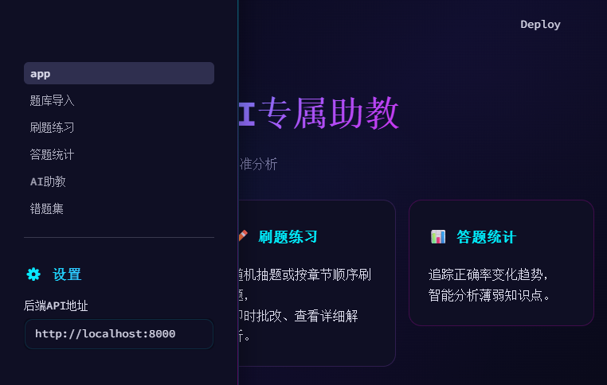
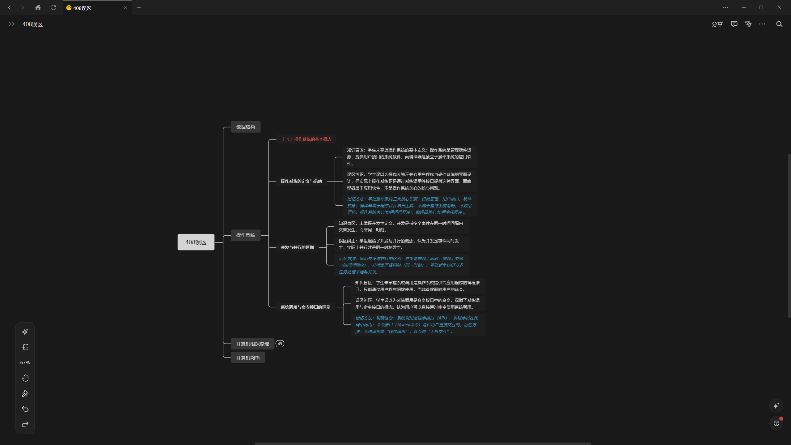

# 408考研AI专属助教

<p align="center">
  
</p>

一款面向计算机考研408统考的**智能刷题 + 错题分析 + 知识盲区管理**工具。支持从 PDF 题库批量导入题目，提供在线刷题、AI助教答疑、薄弱知识点分析等功能，**并能通过 MCP 协议与本地 AI Agent（如 QoderWork CN）及笔记工具（FlowUs 等）联动，打造从「刷题→分析→记录→复习」的完整学习闭环。**

---

## 最新版本：v0.2.3

本次发布聚焦于高精度本地题库提取、刷题页面渲染加固与题库共享。

- 新增 MinerU 高精度扫描 PDF 本地提取工作流，支持 GPU 加速设置。
- 新增 `scripts/qc_question_bank.py`，可在导入后生成可复现的 QC 报告（Markdown / CSV / JSON 三种格式）。
- 新增 `tools/bank_builder/` 本地题库包构建器，将 MinerU Markdown 输出转换为自包含、可导入的 `bank.db` 题库包，含元数据、校验和与 QC 报告。
- 新增 Agent 笔记导出系统（`/api/agent-exports` API + `scripts/export_agent_notes.py` 命令行工具），可生成错题、薄弱知识点、误区分析的 Markdown/JSON 快照，供桌面 Agent 消费。
- 加固导入 MinerU 内容的刷题渲染：图片、`<details>` 块、Mermaid/text_image 辅助描述、HTML 表格、LaTeX 数组、表格内 LaTeX、损坏的代码围栏。
- 缺少 A/B/C/D 选项的不完整选择题从正常刷题中排除，但原始记录保留在数据库和 QC 报告中供手动修复。
- **题库导出增强**：`export_bank()` 现在导出 3 张表（questions、question_assets、answer_candidates）并复制媒体文件。4 个科目题库包已推送到 GitHub（共 2872 题、195 张图片、部分答案），clone 后直接在「自选题库」中导入即可使用，无需自行提取 PDF。
- 当前导入的王道运行时题库包含 `2872` 道题目和 `195` 个索引题目资产。操作系统和组成原理包含部分预置答案，数据结构和计网的答案待首次作答时由 DeepSeek 自动生成。

详见 [RELEASE_NOTES.md](RELEASE_NOTES.md)。

---

## 功能概览

**📥 题库导入** — 支持导入仓库内置题库包，或上传 MinerU Markdown、文字型 PDF 等自有资料，自动解析选择题和综合题，识别科目、章节、知识点标签并入库。扫描型 PDF 属于高级功能，需要配置视觉模型 API。

**✏️ 刷题练习** — 按科目/章节随机或顺序刷题，即时批改并显示正确答案与解析。支持批量刷题模式和进度追踪。

**📊 答题统计** — 追踪各科正确率变化趋势，智能分析薄弱知识点，按知识点维度统计掌握情况。

**🤖 AI助教** — 基于 DeepSeek 大模型的智能问答，可针对具体题目或知识点进行深入讲解和答疑。

**📕 错题集** — 答错题目自动收集，支持按科目/章节/状态筛选，逐题或批量重做，状态标记（已掌握/待巩固/未重做），手动添加和移除。

**🧠 知识盲区分析** — AI 自动分析错题中的知识盲区和常见误区，生成纠正建议和记忆方法。

**📤 Agent 笔记导出** — 将错题、薄弱知识点、误区分析导出为 Markdown/JSON 快照，供桌面 AI Agent 读取并同步至 FlowUs、Notion、Obsidian 等笔记工具。

---

## 🚀 智能复习闭环 — 与桌面 AI Agent 联动

本项目的核心价值不止于本地刷题，更在于它可以**作为数据源被桌面 AI Agent 读取和利用**，实现自动化的知识管理。

### 工作流程

```
刷题练习 → 自动收集错题 & 薄弱知识点
                    ↓
         本地 AI Agent（如 QoderWork CN）
         通过 MCP 协议读取 SQLite 数据库
                    ↓
         自动将薄弱点 / 错题分析推送至
         FlowUs / Notion / 语雀 等笔记工具
                    ↓
         结构化存储 → 定期回顾 → 高效复习
```



> 上图展示的是通过桌面 Agent 将错题分析自动推送至 FlowUs 后的效果：薄弱知识点按科目/章节结构化整理，附带 AI 生成的纠正建议和复习标记，方便随时回顾。

### 具体实现

1. **错题数据库** — 项目使用 SQLite 本地运行时数据库（`data/app_questions.db`），包含完整的错题记录、薄弱知识点统计和 AI 误区分析结果，数据完全在本地，安全可控。

2. **MCP 连接** — 桌面 AI Agent（如推荐使用的 **QoderWork CN**）内置 MCP（Model Context Protocol）支持，可以直接连接本地 SQLite 数据库，读取错题数据和知识点掌握情况。

3. **自动推送笔记** — 配置 MCP 后，Agent 可自动将每日错题分析、薄弱知识点、AI 生成的纠正建议推送到你常用的笔记工具（FlowUs、Notion、Obsidian 等），形成结构化的复习笔记。

4. **高效复习** — 笔记工具中的知识盲区按科目、章节、错误频次整理，支持标签化检索和定期回顾，让复习不再盲目。

---

### Agent 笔记导出

错题和薄弱点分析可以显式导出为 Markdown/JSON，供桌面 Agent 或本地笔记工作流读取：

```bash
# 通过命令行导出
python scripts/export_agent_notes.py --output exports/agent_notes

# 或通过 API 触发
curl -X POST http://127.0.0.1:8000/api/agent-exports
```

导出目录结构：

```
exports/agent_notes/
├── manifest.json              # 导出清单（指向最新快照）
└── 20260625-120000/           # 时间戳命名的快照目录
    ├── json/
    │   ├── wrong_questions.json
    │   ├── weak_points.json
    │   └── misconceptions.json
    └── markdown/              # 按科目/章节/知识点组织的笔记
        ├── 操作系统/
        │   └── 1.1 操作系统的基本概念/
        │       └── 1.1 操作系统的基本概念.md
        └── ...
```

桌面 Agent 可读取 `exports/agent_notes/manifest.json` 找到最近一次导出，并将 Markdown 笔记同步到 FlowUs、Notion、Obsidian、语雀或本地知识库。后端只负责生成本地快照，不直接连接第三方笔记软件。详见 [docs/agent-notes-export.md](docs/agent-notes-export.md)。

---

## 🎯 推荐：QoderWork CN — 适合大学生的桌面 AI Agent

> **推荐使用 QoderWork CN 作为本项目联动的桌面 AI 智能体。**  
> 它由阿里旗下的 Qoder 团队开发，内置 MCP 协议支持，可直接读取本地数据库、操作文件、调用应用，无需复杂配置。

### 为什么推荐 QoderWork CN

- **本地优先** — 文件操作在本地完成，数据安全可控，无需上传云端
- **内置 MCP** — 原生支持 Model Context Protocol，可无缝连接 SQLite 数据库、API 服务等
- **Skills 生态** — 支持安装和自定义技能，可一键配置「408错题分析」专属工作流
- **下载即用** — 零配置，无需折腾命令行和环境部署
- **🎉 大学生专属福利** — 通过身份核验的在校大学生可**免费领取 3 个月 Pro 订阅**（价值约 180 元），包含 4,000 Credits 额度

### 下载与福利

👉 **[点此下载 QoderWork CN 并领取免费 Pro](https://qoder.com.cn/referral?referral_code=AEjuX4rRbU46x4Do3ZvBV4fRqSVRxrgQ)**

```
新用户注册即享首月 Pro 免费
大学生 / 教师认证额外领 4,000 Credits（3 个月有效）
```

### 联动配置示例

安装并启动 QoderWork CN 后，你只需用自然语言描述需求，例如：

> "读取 `data/app_questions.db` 中所有 `last_status='wrong'` 的错题记录，按科目分组整理成表格，推送到我的 FlowUs 笔记中，标题为「408错题回顾 - 本周待巩固」。"

QoderWork CN 将自动规划步骤、执行数据库查询、整理数据并推送到你的笔记工具。

---

## 技术栈

| 层级 | 技术 |
|------|------|
| 后端框架 | FastAPI + Uvicorn |
| 前端框架 | Streamlit (赛博朋克暗黑主题) |
| 数据库 | SQLite + SQLAlchemy 2.0 (ORM) |
| PDF解析 | PyMuPDF + VLM 视觉降级策略 |
| Markdown解析 | MinerU 输出 + 自研 MarkdownParser |
| AI推理模型 | DeepSeek API (OpenAI 兼容接口) |
| AI视觉模型 | 通义千问VL / Qwen-VL (DashScope API，用于扫描PDF识别) |
| 架构模式 | Model → Repository → Service → Router 分层架构 |

## 快速开始

### 环境要求

- Python 3.12+
- pip

### 1. 克隆项目

```bash
git clone https://github.com/6wa1t/408-ai-tutor.git
cd 408-ai-tutor
```

### 2. 安装依赖

```bash
# 后端依赖
pip install -r backend/requirements.txt

# 前端依赖
pip install -r frontend/requirements.txt
```

### 3. 配置环境变量

复制环境变量模板并填入你的 API Key：

```bash
cp .env.example .env
```

本项目使用**双模型架构**，需要分别配置推理模型和视觉模型：

| 用途 | 推荐模型 | 获取方式 |
|------|---------|---------|
| **推理模型** (AI助教、答题、知识分析) | DeepSeek-Chat | [platform.deepseek.com](https://platform.deepseek.com/api_keys) |
| **视觉模型** (扫描PDF识别、图片OCR) | Qwen-VL-Max | [bailian.console.aliyun.com](https://bailian.console.aliyun.com/) |

> DeepSeek 不支持图片输入，因此扫描版 PDF 的题目提取需要单独的视觉模型。如果只用文字型 PDF，可以不配视觉模型。

编辑 `.env` 文件：

```env
# ===== 推理模型 (必配) =====
# DeepSeek API — 用于 AI 助教对话、答题解析、知识盲区分析
# 获取地址: https://platform.deepseek.com/api_keys
LLM_API_BASE=https://api.deepseek.com
LLM_API_KEY=sk-your-deepseek-api-key-here
LLM_MODEL=deepseek-chat

# ===== 视觉模型 (可选，扫描PDF需要) =====
# 通义千问VL — 用于扫描版 PDF 的图像识别和题目提取
# 获取地址: https://bailian.console.aliyun.com/ (新用户有免费额度)
# 如果只使用文字型 PDF，可以不配置此项
VISION_API_BASE=https://dashscope.aliyuncs.com/compatible-mode/v1
VISION_API_KEY=sk-your-dashscope-api-key
VISION_MODEL=qwen-vl-max

# ===== 应用配置 =====
DEBUG=true
LOG_LEVEL=INFO
```

### 4. 启动应用

```bash
python start.py
```

启动后自动打开浏览器，访问以下地址：

- 前端界面：http://127.0.0.1:8501
- 后端 API：http://127.0.0.1:8000
- API 文档：http://127.0.0.1:8000/docs

### 5. 导入题库

在前端「题库导入」页面选择仓库内置题库，或上传自己的 408 资料，系统会自动解析题目并入库。

也可以在命令行批量导入：

```bash
python import_pdfs.py --pdf-dir /path/to/your/pdf/folder
```

## 内置题库包

### 题库来源

部署后可以通过两种方式获得题库：

1. **使用仓库内置题库** — 在「题库导入 -> 自选题库」中选择 `question_banks/` 内的题库包，导入后写入本地运行时数据库。当前仓库内置 4 个王道题库包：

   | 科目 | 题目数 | 含图片 | 含答案 |
   |------|--------|--------|--------|
   | 数据结构 | 803 | 是 | 否 |
   | 操作系统 | 752 | 是 | 部分预置 |
   | 计算机组成原理 | 677 | 是 | 部分预置 |
   | 计算机网络 | 640 | 是 | 否 |

   共 2872 道题目、195 张图片。clone 仓库后直接在「自选题库」Tab 勾选导入即可，题目、图片和答案候选会一并写入运行时数据库，无需自行提取 PDF。导入后图片自动复制到 `images/question_assets/`，答案候选写入 `answer_candidates` 表。

2. **导入自己的资料** — 推荐使用 MinerU Markdown，其次是文字型 PDF；扫描型 PDF 属于高级功能，需要配置视觉模型 API 后才能完成图片识别。

内置题库包采用 `question_banks/<bank_id>/` 目录格式，包含 `metadata.json` + `bank.db`（3 张表：questions、question_assets、answer_candidates）+ `media/images/` 图片资产。`questions.db` 是旧包兼容格式，仍可导入。

### 题库构建工具

如果需要从 MinerU Markdown 输出自行构建题库包，可以使用内置的 `tools/bank_builder/` 工具：

```bash
python -m tools.bank_builder.build_bank \
  --input data/mineru_wangdao_output/questions_high_gpu_serial \
  --output question_banks/wangdao_bank \
  --bank-id wangdao-408 \
  --name "王道408题库" \
  --subject 综合
```

该工具完成「发现 → 解析 → 媒体拷贝 → 写入 bank.db → QC 报告」全流程，产出自包含的可导入题库包。详见 [tools/bank_builder/README.md](tools/bank_builder/README.md)。

### 答案与解析

题库不要求所有题目都预置答案。选择题首次作答时，如果题库中没有可信答案，系统会调用用户配置的 DeepSeek API 生成答案候选、解析和置信度，并写入本地 `answer_candidates` 表。

只有高置信度答案会参与自动判分和统计；低置信度答案仅作为参考解析展示，不计入正确率。前端会显示答案来源（题库内置 / 来源提取 / DeepSeek 生成 / 用户确认）、置信度，以及该答案是否参与判分。

内置题库包中操作系统和组成原理已包含部分预置答案（从旧版本数据库迁移），数据结构和计网的答案将在首次作答时由 DeepSeek 自动生成并缓存。

### 运行时路径

| 路径 | 说明 |
|------|------|
| `data/app_questions.db` | 默认运行时数据库 |
| `question_banks/` | 内置题库包目录（含 bank.db + media/ + metadata.json） |
| `images/question_assets/` | 运行时题目媒体目录 |
| `exports/agent_notes/` | Agent 笔记导出快照目录 |
| `data/reports/` | QC 报告输出目录 |
| `data/questions.db` | 旧版本可能存在的数据库；升级后建议迁移或重新导入到 `data/app_questions.db` |

## 项目结构

```
408-ai-tutor/
├── backend/                    # FastAPI 后端
│   ├── app/
│   │   ├── api/               # 路由层 (9组API端点)
│   │   ├── core/              # 核心模块 (日志、异常)
│   │   ├── database/          # 数据库连接、会话管理、schema同步
│   │   ├── models/            # ORM 模型 (12张表)
│   │   ├── repositories/      # 数据访问层
│   │   ├── schemas/           # Pydantic 数据校验
│   │   ├── services/          # 业务逻辑层 (15个服务模块)
│   │   ├── utils/             # 工具函数
│   │   ├── config.py          # 应用配置
│   │   └── main.py            # FastAPI 入口
│   ├── alembic/               # 数据库迁移
│   ├── tests/                 # 单元测试 (含 bank_builder 子套件)
│   ├── Dockerfile
│   └── requirements.txt
├── frontend/                   # Streamlit 前端
│   ├── app.py                 # 首页入口
│   ├── shared/                # 共享模块 (API客户端、题库标签、题目渲染、样式)
│   ├── pages/                 # 5个功能页面
│   ├── .streamlit/            # Streamlit 主题配置
│   ├── Dockerfile
│   └── requirements.txt
├── tools/                      # 本地工具
│   └── bank_builder/          # 题库包构建器 (MinerU MD → bank.db)
├── scripts/                    # 辅助脚本
│   ├── export_agent_notes.py  # Agent 笔记导出
│   ├── export_bank.py         # 题库导出
│   ├── qc_question_bank.py    # 题库 QC 报告
│   ├── post_import_process.py # 导入后处理 (图片提取+PUA修复)
│   ├── repair_garbled_text.py # 乱码修复
│   ├── repair_pua.py          # PUA 字符修复
│   ├── rebuild_image_paths.py # 图片路径重建
│   ├── clean_existing_questions.py # 题目文本清理
│   ├── extract_images.py      # PDF 图片提取
│   └── run_mineru_questions_gpu.ps1 # MinerU GPU 运行脚本
├── docs/                       # 文档
│   └── agent-notes-export.md  # Agent 笔记导出系统文档
├── data/                       # SQLite 数据库文件 (可供 Agent 直接读取)
├── exports/                    # Agent 笔记导出快照
├── question_banks/             # 内置题库包 (bank.db + media/ + metadata.json)
│   ├── manifest.json          # 题库索引
│   ├── 数据结构/               # 803题 + 80张图片
│   ├── 操作系统/               # 752题 + 25张图片 + 部分答案
│   ├── 计算机组成原理/         # 677题 + 23张图片 + 部分答案
│   └── 计算机网络/             # 640题 + 67张图片
├── images/
│   ├── question_assets/        # 运行时题目媒体资源
│   └── questions/              # 旧导入流程提取的题目图片
├── logs/                       # 日志文件
├── homepage.png                # 首页截图
├── start.py                    # 一键启动脚本
├── import_pdfs.py              # 命令行PDF批量导入
├── migrate_misconceptions.py   # 误区表迁移检查脚本 (已废弃，保留只读)
├── debug_check.py              # API 冒烟测试脚本
├── pyproject.toml              # 项目元数据与 pytest 配置
├── RELEASE_NOTES.md            # 发布说明
├── .env.example                # 环境变量模板
└── docker-compose.yml          # Docker 部署
```

## 数据库设计

| 表名 | 说明 |
|------|------|
| `questions` | 题目主表 (题干、选项、答案、解析、图片、溯源) |
| `quiz_records` | 作答记录 (每次答题的详细结果) |
| `misconceptions` | **知识盲区** (AI分析的错误模式和纠正建议，含 `flowus_synced` 增量同步标记) |
| `weak_knowledge` | **薄弱知识点** (按知识点维度统计正确率，可直接供 Agent 读取分析) |
| `wrong_questions` | **错题集** (自动收集+手动管理，支持重做追踪，是 Agent 联动的核心数据表) |
| `conversations` | **对话历史** (AI助教的对话上下文管理，支持书签标记) |
| `chat_messages` | **对话消息** (对话中的逐条消息记录，与 conversations 一对多) |
| `question_assets` | 题目媒体资源索引 (图片、表格等运行时素材路径和溯源) |
| `answer_candidates` | 答案候选与置信度 (题库内置、来源提取、DeepSeek 生成、用户确认等来源) |
| `bank_imports` | 题库包导入记录 (导入状态、来源路径、QC 报告路径和统计信息) |
| `review_notes` | **复习笔记** (为薄弱知识点生成的笔记内容，供 Agent 读取) |
| `agent_exports` | **Agent 导出记录** (跟踪笔记导出运行的元数据：路径、清单、时间戳) |

> 💡 `wrong_questions`、`misconceptions`、`weak_knowledge` 三张表是桌面 Agent 的最佳数据源，通过 MCP 连接后可实现自动化的知识盲区管理和复习提醒。`review_notes` 和 `agent_exports` 进一步支持结构化的笔记生成和导出追踪。

## API 概览

| 模块 | 前缀 | 说明 |
|------|------|------|
| 题库导入 | `/api/import` | PDF上传、MinerU Markdown导入、目录批量导入、导入报告 (支持 text_pdf / scanned_pdf / markdown 三种模式) |
| 题目管理 | `/api/questions` | 题目CRUD、按科目/章节/题型查询 |
| 刷题练习 | `/api/quiz` | 抽题、提交答案、批次刷题 |
| AI助教 | `/api/tutor` | 智能问答对话 (非流式+流式) |
| 知识盲区 | `/api/misconceptions` | 盲区列表、统计分析 |
| 错题集 | `/api/wrong-questions` | 错题管理、重做、批量操作 |
| 对话管理 | `/api/conversations` | AI助教对话历史管理、书签 |
| 薄弱知识点 | `/api/weak-knowledge` | 知识点掌握度查询、统计分析 |
| Agent导出 | `/api/agent-exports` | 笔记导出生成与历史查询 |

完整 API 文档启动后访问 http://127.0.0.1:8000/docs

## Docker 部署 (可选)

```bash
# 1. 配置 API Key（可选，不配也能启动但AI功能不可用）
cp .env.example .env
# 编辑 .env，填入你的 LLM_API_KEY（DeepSeek）

# 2. 构建并启动（Docker Compose 自动读取 .env）
docker compose up -d

# 3. 访问
# 前端: http://localhost:8501
# 后端: http://localhost:8000
```

> 💡 **关于 `.env` 文件**：Docker Compose 自动读取项目根目录的 `.env` 文件，
> 将其中定义的变量注入到容器环境变量中。没有 `.env` 也能启动，
> 但 AI 助教功能会降级（显示"API未配置"提示），不影响刷题等核心功能。
>
> Docker 会自动挂载 `data/`、`images/`、`logs/`、`question_banks/`、`exports/` 目录持久化数据，
> 重启容器不会丢失题库和答题记录。内置题库包通过 `question_banks/` 卷挂载到容器，
> 导入时图片和答案会一并写入 `images/`（同样卷挂载），Docker 部署与本地启动的题库导入流程完全一致。

## 开发说明

```bash
# 运行后端测试
cd backend
pytest -v

# 或从项目根目录运行（pyproject.toml 已配置 testpaths 和 pythonpath）
pytest -v

# 单独启动后端
cd backend
uvicorn app.main:app --reload --host 0.0.0.0 --port 8000

# 单独启动前端
cd frontend
streamlit run app.py --server.port 8501

# 构建题库包
python -m tools.bank_builder.build_bank --input <mineru_output> --output <bank_dir>

# 导出 Agent 笔记
python scripts/export_agent_notes.py --output exports/agent_notes

# 生成 QC 报告
python scripts/qc_question_bank.py
```

## 常见问题

**Q: AI助教功能需要联网吗？**
A: 需要。AI助教和知识盲区分析依赖 DeepSeek API，需要有效的 API Key 和网络连接。刷题和题库管理功能可以离线使用。

**Q: 支持哪些PDF格式？**
A: 支持两种 PDF：①**文字型 PDF**（如王道电子版题本）— 直接通过 PyMuPDF 提取文本，速度快，无需视觉模型；②**扫描型/图片型 PDF** — 系统自动检测并降级到 VLM 视觉模型（通义千问VL），逐页渲染为图片后通过 OCR 识别题目，需要配置 `VISION_API_KEY`。上传时也可以勾选「强制使用 VLM」跳过文本提取。

**Q: 为什么需要两个 API Key？**
A: 本项目使用双模型架构：DeepSeek 负责推理（AI 助教对话、答题分析），通义千问VL 负责视觉（扫描 PDF 识别、图片 OCR）。DeepSeek 的 API 不支持图片输入，所以需要单独的视觉模型。如果你只用文字型 PDF，只需配 DeepSeek 即可。

**Q: 数据库文件在哪里？**
A: 默认在 `data/app_questions.db`，SQLite 单文件运行时数据库。备份只需复制该文件，**桌面 AI Agent 可直接通过 MCP 协议读取此文件**进行数据分析。旧版本可能存在 `data/questions.db`；升级后建议迁移或重新导入到 `data/app_questions.db`。

**Q: 内置题库包含哪些内容？**
A: 仓库内置 4 个王道科目题库包（数据结构 803 题、操作系统 752 题、组成原理 677 题、计网 640 题），每个包包含完整题目文本、选项、图片资产和部分答案候选。clone 后在「题库导入 -> 自选题库」中直接导入即可，无需自行提取 PDF 或配置视觉模型。

**Q: 如何与 QoderWork CN 联动？**
A: 安装 QoderWork CN 后，无需额外配置，直接在对话中描述需求即可。例如：「读取 408 错题数据库中本周新增的误区分析，整理成复习笔记推送到 FlowUs」。

**Q: 如何从 MinerU 输出构建自己的题库包？**
A: 使用 `tools/bank_builder/` 工具：`python -m tools.bank_builder.build_bank --input <mineru_output_dir> --output <bank_output_dir> --bank-id <id> --name <name> --subject <subject>`。工具会自动解析 Markdown、拷贝图片媒体、生成 bank.db 和 QC 报告。详见 [tools/bank_builder/README.md](tools/bank_builder/README.md)。

## 开源协议

本项目基于 [MIT License](LICENSE) 开源。

---

> **让 AI 不止于答题，更成为你的专属学习管家。**  
> 从智能刷题到知识盲区管理，再到桌面 Agent 自动整理笔记 —— 高效备考 408，这一个工具就够了。
